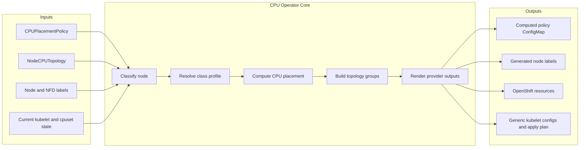
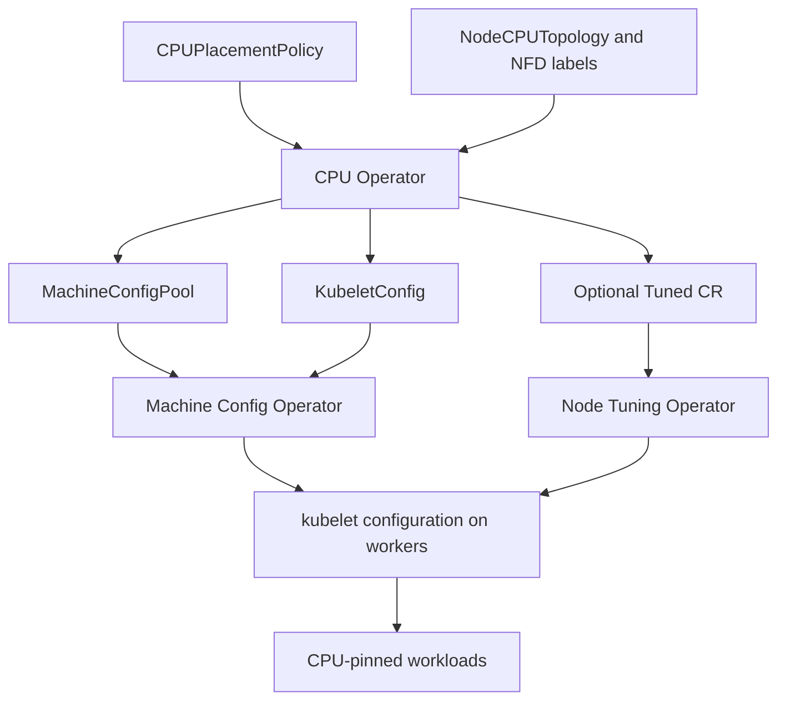
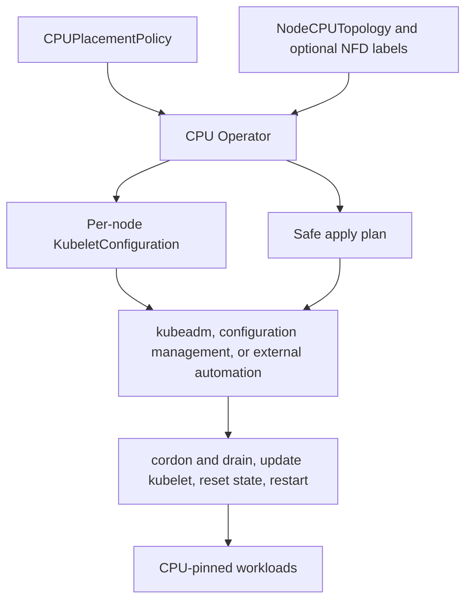

# Architecture

## Scope

CPU Operator separates portable CPU-placement logic from provider-specific node configuration. The portable core discovers topology, classifies nodes, computes CPU placement, groups compatible nodes, and renders desired kubelet settings. Provider backends decide whether those settings are applied or handed to external automation.

The design intentionally leaves final CPU allocation and enforcement to established Kubernetes and Linux mechanisms:

- kubelet CPU Manager owns exclusive CPU assignment;
- kubelet Topology Manager owns NUMA alignment;
- the container runtime and Linux cgroups establish CPU visibility;
- process affinity, reported by `Cpus_allowed_list`, is the preferred live validation signal.

## Inputs, processing, and outputs



### Input categories

| Input | Source | Purpose |
|---|---|---|
| `CPUPlacementPolicy` | Cluster administrator | Selects nodes, provider mode, classification overrides, profile defaults, and apply behavior. |
| `NodeCPUTopology` | Node Topology Agent | Supplies NUMA CPU lists, core and sibling mapping, memory topology, AMX data, GPU count/locality, and current CPU Manager state. |
| Node labels | Kubernetes, OpenShift, NFD, GPU Operator, or administrator | Supplies hardware features, workload intent, and optional classification overrides. |
| Provider APIs | OpenShift or generic Kubernetes | Determines which configuration resources can be rendered or managed. |

### Intermediate outputs

| Stage | Output |
|---|---|
| Discovery | `NodeCPUTopology.status` for each worker. |
| Classification | Node class, reason, AMX state, GPU state, and selected profile. |
| Placement | CPU pools, NUMA-local sets, reservations, and preferred NUMA nodes. |
| Grouping | Topology groups for nodes requiring compatible kubelet configuration. |
| Rendering | Node labels, OpenShift manifests, generic kubelet configuration, and apply plans. |

### Final outputs

The primary output is `<policy-name>-computed-cpu-policy`. It records the normalized provider settings, classifications, topology groups, placement, labels, and rendered provider artifacts. Generic Kubernetes also receives a separate output ConfigMap containing one kubelet configuration per node and `apply-plan.yaml`.

## Components

### Node Topology Agent

The agent runs as a DaemonSet on selected worker nodes. It publishes details that are normally too fine-grained for NFD labels alone:

- logical CPU-to-core, socket, and NUMA mapping;
- thread sibling lists;
- NUMA memory information;
- AMX BF16 and INT8 capability;
- optional GPU PCI device and NUMA locality;
- current kubelet CPU Manager checkpoint and effective CPU state.

Typical host data sources are:

```bash
lscpu -e=CPU,CORE,SOCKET,NODE,ONLINE
numactl --hardware
cat /sys/devices/system/node/node*/cpulist
cat /sys/devices/system/cpu/cpu*/topology/thread_siblings_list
cat /var/lib/kubelet/cpu_manager_state
```

For GPU locality, the agent can use PCI NUMA information and vendor filtering. The default DaemonSet allowlist includes NVIDIA vendor ID `0x10de` to avoid treating BMC VGA devices as inference GPUs.

### CPU Operator

The operator watches `CPUPlacementPolicy`, `NodeCPUTopology`, and relevant node labels. Reconciliation performs the following ordered work:

1. select target nodes;
2. merge topology and feature inputs;
3. classify each node;
4. select or override the class profile;
5. compute placement and reservations;
6. build stable topology groups;
7. render labels and provider resources;
8. optionally apply provider resources;
9. record status and generated artifacts.

### NFD integration

NFD is the preferred source for feature labels when installed, for example:

```text
feature.node.kubernetes.io/cpu-cpuid.AMX_BF16=true
feature.node.kubernetes.io/cpu-cpuid.AMX_INT8=true
feature.node.kubernetes.io/pci-10de.present=true
```

NFD labels can fill or override AMX feature fields, but the Node Topology Agent remains the authoritative placement-grade source for CPU IDs, siblings, NUMA layout, and GPU locality.

### TuneD integration

On OpenShift, the operator can generate and optionally apply a `Tuned` custom resource through Node Tuning Operator. The current policy exposes `spec.openshift.manageTuned` and `spec.openshift.tunedProfile`.

Generic Kubernetes has no universal TuneD API. Recommended tuning is therefore rendered for external automation or a future node-agent path.

## Provider backends

### OpenShift

OpenShift is the managed apply path because Machine Config Operator provides a supported mechanism for changing kubelet configuration across a MachineConfigPool.



The backend manages or validates:

- one `MachineConfigPool` per topology group;
- one `KubeletConfig` per topology group;
- CPU Manager policy and policy options;
- Topology Manager policy and scope;
- `reservedSystemCPUs` when a consistent reservation exists;
- optional `Tuned` resources;
- provider rollout status and workload-facing labels.

Managed changes can drain or reboot nodes through MCO. A policy should first be reviewed in `RecommendationOnly` mode when used on an unfamiliar cluster.

### Generic Kubernetes

Generic Kubernetes does not include an upstream Machine Config Operator equivalent. The `GenericKubernetes` provider therefore renders artifacts rather than mutating hosts. kubeadm, Cluster API, configuration management, or other external automation can consume those artifacts.



The safe external flow is:

```text
cordon and drain the node
stop kubelet
back up kubelet configuration
write the updated configuration
remove /var/lib/kubelet/cpu_manager_state when changing CPU Manager policy
start kubelet
wait for Node Ready
uncordon the node
validate CPU Manager and workload placement
```

## CPU placement and enforcement boundary

The operator can compute conceptual pools such as `cpuPodCPUSet`, `gpuPodCPUSet`, and `otherPodsReservedCPUSet`. These values describe policy intent and are useful for rendering configuration, validation, and workload planning.

### Current CPU-count semantics

CPU counts in placement profiles are logical CPUs / Kubernetes vCPUs unless explicitly stated otherwise.

Current `main` defaults are:

```text
mixed-cpu-amx-gpu:
  gpuPodReservedCPUs = 24 logical CPUs total

cpu-amx:
  reservedOtherPodsPerNuma = 1 logical CPU per NUMA node
```

For `cpu-amx`, the per-NUMA other-pods set becomes `systemReservedCPUSet` and is mapped to kubelet `reservedSystemCPUs`. These CPUs are removed from CPU Manager's exclusive allocation pool.

For `mixed-cpu-amx-gpu`, `gpuPodReservedCPUs` is a GPU-workload placement/capacity target. The computed `gpuPodCPUSet` is intentionally **not** mapped to `reservedSystemCPUs`; GPU workloads still need those CPUs to remain allocatable.

`full-pcpus-only: "true"` affects kubelet's exclusive allocation behavior, but it does not reinterpret `gpuPodReservedCPUs` or `reservedOtherPodsPerNuma` as physical-core counts. On SMT2 systems, two logical CPUs normally correspond to one physical core.

A normal Kubernetes pod, however, requests an integer CPU quantity. kubelet CPU Manager chooses the exact CPU IDs that satisfy its policy and Topology Manager hints. Consequently:

- matching CPU counts with different exact IDs can be valid;
- exact named-pool enforcement requires an additional mechanism;
- `reservedSystemCPUs` removes CPUs from kubelet's allocatable exclusive pool and must not be used for CPUs that GPU pods still need to request exclusively.

### Shared versus exclusive CPU sets

A shared container can show the entire shared pool, such as `0-95`. This means its threads may run on any CPU in that pool. It does not mean the container is continuously using 96 CPUs.

An exclusive container has a CPU Manager checkpoint assignment, such as `8-15`. Those CPUs are removed from the shared pool for the lifetime of the allocation.

For live validation, compare CPU Manager state with `/proc/self/status`:

```bash
grep Cpus_allowed_list /proc/self/status
```

Some privileged containers expose a broad host cgroup root under `/sys/fs/cgroup`; the process affinity is therefore a safer primary signal than the root `cpuset.cpus.effective` file.

## Optional extensions

- **DRA:** useful when CPU topology claims must become scheduler-visible resources. It is not required for baseline CPU pinning.
- **NRI:** useful for runtime-level CPU pool enforcement or advanced container placement. It is optional and should not replace kubelet CPU Manager without a clear ownership model.
- **Node-agent apply:** a possible future generic Kubernetes backend for privileged host configuration.
- **Cluster API:** a possible future renderer for machine templates and bootstrap configuration.

## Current PoC boundaries

- OpenShift managed apply and generic recommendation-only rendering share one core implementation.
- The OpenShift `spec.phase4` fields remain for backward compatibility with the provider model.
- Admission validation for Guaranteed QoS and impossible placement is a design goal, not a complete production webhook in this PoC.
- The generated policy is the audit record for what the operator calculated; cluster state must still be verified after MCO or external automation completes.
