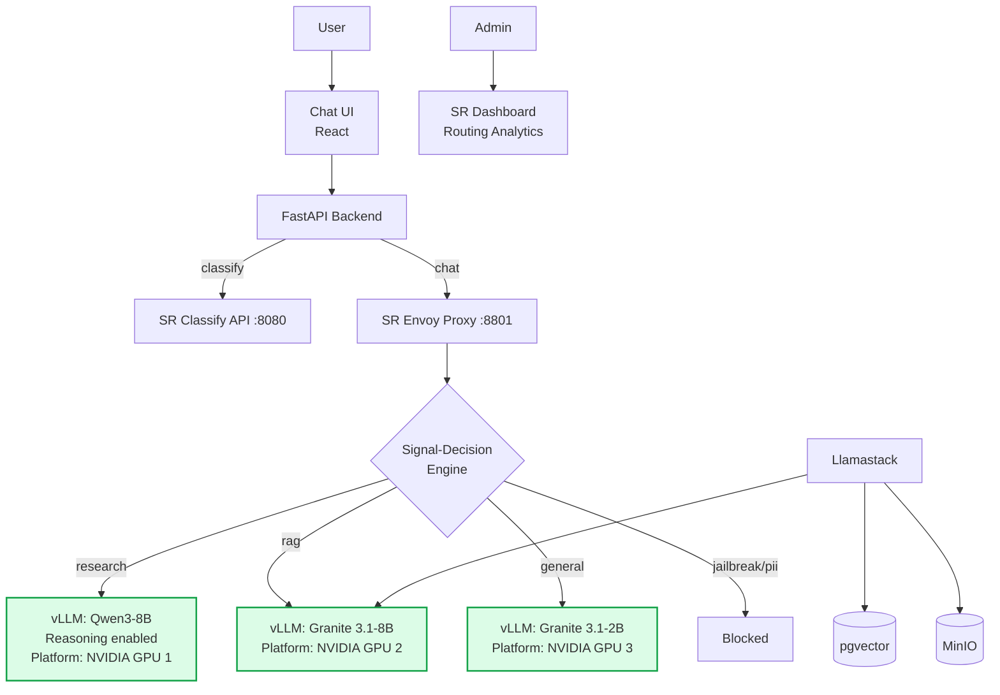
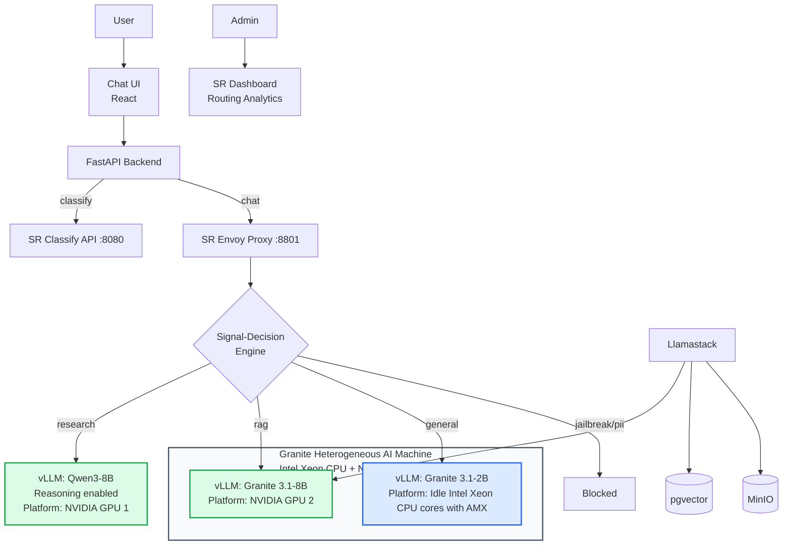

# vLLM Semantic Router: Original and CPU-Optimized Architectures

## 1. Original Architecture — Three GPU Model Deployments

The current vLLM Semantic Router implementation deploys all three models on NVIDIA GPUs.

### Original Platform Allocation

- Qwen3-8B runs on NVIDIA GPU 1.
- Granite 3.1-8B runs on NVIDIA GPU 2.
- Granite 3.1-2B runs on NVIDIA GPU 3.
- Total deployment requirement: **three GPUs**.

---

## 2. Improved Architecture — Use Idle CPU Capacity

The improved design keeps the two 8B models on GPUs and moves the smaller Granite 3.1-2B model onto idle Intel Xeon CPU cores in the same machine that hosts Granite 3.1-8B.

### Improved Platform Allocation

- Qwen3-8B remains on NVIDIA GPU 1.
- Granite 3.1-8B remains on NVIDIA GPU 2.
- Granite 3.1-2B moves from GPU 3 to idle Intel Xeon CPU cores on the Granite 3.1-8B machine.
- Total deployment requirement is reduced from **three GPUs to two GPUs**.

---

## 3. How CPU Operator Enables the Deployment

CPU Operator prepares the worker node for predictable CPU inference. It discovers the CPU and NUMA topology, calculates CPU placement policies, and assigns topology-aware CPU resources to the Granite 3.1-2B vLLM pod.

It also preserves enough host CPU capacity for the Granite 3.1-8B GPU workload, including request handling, networking, scheduling, and token orchestration.

The semantic router continues to decide which model handles each request. CPU Operator manages how the CPU-hosted model receives suitable resources on the shared machine.

---

## 4. Business and Cost Benefits

### Reduce GPU Requirement

Moving Granite 3.1-2B from GPU 3 to idle CPU capacity reduces the deployment from three GPUs to two GPUs.

### Use Existing CPU Capacity

GPU machines often have many CPU cores that are not fully utilized during inference. The smaller 2B model can use these available cores instead of consuming another GPU.

### Preserve GPUs for Larger Models

The two 8B models remain on GPUs for stronger performance, while the smaller general-purpose model runs on CPU.

### Lower Deployment Cost

The released third GPU can be:

- Removed from the deployment to lower infrastructure cost
- Returned to a shared GPU resource pool
- Used by another application
- Used to add capacity for an existing GPU model
- Used later for a larger or more capable reasoning model

### Improve Overall Resource Utilization

The machine uses both CPU and GPU resources more effectively instead of leaving host CPU capacity idle while allocating a separate GPU to the smallest model.

---

## 5. Key Value Statement

> Use the idle Intel Xeon CPU cores of the Granite 3.1-8B GPU machine to run the lightweight Granite 3.1-2B model. This preserves GPU capacity for the two larger 8B models and reduces the deployment requirement from three GPUs to two.
